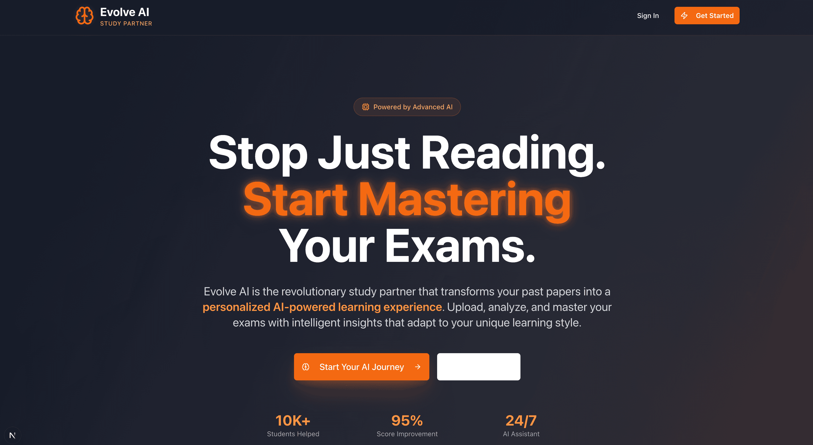
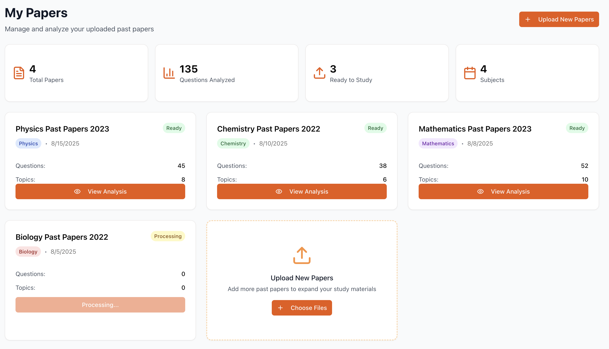

# Evolve AI Study Partner

<div align="center">
  
  
  <p><em>Transform your exam preparation with AI-powered insights and personalized learning</em></p>
</div>

<div align="center">
  
  
  <p><em>Transform your exam preparation with AI-powered insights and personalized learning</em></p>
</div>

An AI-powered study platform that transforms past exam papers into personalized learning experiences. Built with Next.js 15, TypeScript, and Tailwind CSS.

   

## 🚀 Features

### 🎯 Core Functionality
- **AI-Powered Analysis**: Upload past papers and get comprehensive trend analysis
- **Personalized Practice**: Adaptive quizzes tailored to your weak spots
- **Dynamic Study Plans**: Intelligent study plans that evolve with your progress
- **Performance Analytics**: Detailed insights into your learning journey
- **Interactive Dashboard**: Centralized hub for all study activities

### 📱 Pages & Components
- **Landing Page**: Compelling hero section with features, testimonials, and CTA
- **Authentication**: Sign-up and sign-in with form validation
- **Dashboard**: Upload widget, progress charts, and study plan overview
- **Paper Analysis**: Interactive tabs with trend analysis and practice sessions
- **Performance**: Comprehensive analytics with charts and skill assessments
- **Settings**: Profile management, notifications, and preferences

### 🎨 Design Features
- **Orange AI Theme**: Professional orange color scheme throughout
- **Glassmorphism Effects**: Modern glass-like UI components
- **Hover Animations**: Smooth lift effects and transitions
- **Responsive Design**: Mobile-first approach with adaptive layouts
- **Accessibility**: Full keyboard navigation and screen reader support

## 🛠️ Tech Stack

- **Framework**: Next.js 15 (App Router)
- **Language**: TypeScript
- **Styling**: Tailwind CSS 3
- **UI Components**: Shadcn/UI
- **Charts**: Recharts
- **Icons**: Lucide React
- **Animation**: CSS3 transitions and keyframes

## 📦 Installation

1. **Clone the repository**
   ```bash
   git clone https://github.com/soongenwong/past-paper-pro.git
   cd past-paper-pro/past-paper-pro-app
   ```

2. **Install dependencies**
   ```bash
   npm install
   ```

3. **Start the development server**
   ```bash
   npm run dev
   ```

4. **Open your browser**
   Navigate to [http://localhost:3000](http://localhost:3000)

## 🗂️ Project Structure

```
past-paper-pro-app/
├── src/
│   ├── app/                     # Next.js App Router
│   │   ├── (auth)/             # Authentication pages
│   │   │   ├── sign-in/        # Sign-in page
│   │   │   └── sign-up/        # Sign-up page
│   │   ├── dashboard/          # Dashboard pages
│   │   │   ├── layout.tsx      # Dashboard layout with sidebar
│   │   │   ├── page.tsx        # Main dashboard
│   │   │   ├── papers/         # Paper management
│   │   │   │   ├── page.tsx    # Papers list (My Papers)
│   │   │   │   └── [paperId]/  # Individual paper analysis
│   │   │   ├── performance/    # Analytics page
│   │   │   └── settings/       # User settings
│   │   ├── globals.css         # Global styles and theme
│   │   ├── layout.tsx          # Root layout
│   │   └── page.tsx            # Landing page
│   ├── components/
│   │   ├── layout/
│   │   │   └── Sidebar.tsx     # Navigation sidebar
│   │   └── ui/                 # Shadcn/UI components
│   │       ├── button.tsx
│   │       ├── card.tsx
│   │       ├── file-upload.tsx # Drag-and-drop upload
│   │       ├── input.tsx
│   │       ├── label.tsx
│   │       ├── progress.tsx
│   │       ├── separator.tsx
│   │       └── tabs.tsx
│   └── lib/
│       └── utils.ts            # Utility functions
├── public/                     # Static assets
├── package.json
├── tailwind.config.ts          # Tailwind configuration
├── tsconfig.json               # TypeScript configuration
└── next.config.ts              # Next.js configuration
```

## 🎨 Theme & Styling

The application uses a custom orange AI theme with the following color palette:

- **Primary Orange**: `#ea580c` (orange-600)
- **Light Orange**: `#fed7aa` (orange-200)
- **Dark Orange**: `#c2410c` (orange-700)
- **Background**: Dark gradients with orange accents
- **Glassmorphism**: Backdrop blur effects for modern UI

### Custom CSS Classes
- `.glass` - Glassmorphism effect
- `.text-gradient-orange` - Orange gradient text
- `.hover-lift` - Hover lift animation
- `.particles-bg` - Animated background particles

## 📊 Features Overview

### 1. Landing Page (`app/page.tsx`)
- Hero section with compelling messaging
- 3-column features section
- How it works (3-step process)
- Student testimonials with ratings
- Call-to-action sections

### 2. Authentication (`app/(auth)/`)
- Sign-up form with full name, email, password
- Sign-in form with email and password
- Form validation and error handling
- Mock authentication logic

### 3. Dashboard (`app/dashboard/page.tsx`)
- Welcome header with personalized greeting
- Upload widget with drag-and-drop functionality
- Performance charts (using Recharts)
- Today's study focus list
- Recent activity feed
- Key metrics overview

### 4. File Upload (`components/ui/file-upload.tsx`)
- Drag-and-drop interface
- File type validation (PDF, DOCX, TXT)
- File size limits (10MB max)
- Upload progress indicator
- Multiple file support (up to 5 files)

### 5. Paper Analysis (`app/dashboard/papers/[paperId]/page.tsx`)
- **Analysis Tab**: 
  - Topic frequency charts
  - Key concepts identification
  - Question type breakdown
- **Practice Tab**:
  - Interactive quiz interface
  - Multiple choice questions
  - Instant feedback
  - Progress tracking

### 6. Performance Analytics (`app/dashboard/performance/page.tsx`)
- Overall accuracy metrics
- Performance trend charts
- Subject-wise breakdown
- Skills radar chart
- Achievement badges
- Study time tracking

### 7. Settings (`app/dashboard/settings/page.tsx`)
- Profile information management
- Notification preferences
- Security settings
- Theme selection
- Data export options

## 🔧 Development Scripts

```bash
# Development
npm run dev          # Start development server

# Building
npm run build        # Build for production
npm run start        # Start production server

# Code Quality
npm run lint         # Run ESLint
npm run type-check   # TypeScript type checking
```

## 📱 Responsive Design

The application is fully responsive with breakpoints:
- **Mobile**: 320px - 768px
- **Tablet**: 768px - 1024px
- **Desktop**: 1024px+

Key responsive features:
- Collapsible sidebar on mobile
- Adaptive grid layouts
- Touch-friendly interactions
- Optimized typography scaling

## 🎯 Mock Data & API Integration

Currently using mock data for demonstration:
- Student profiles and progress
- Past paper analysis results
- Performance metrics
- Achievement data

**Backend Integration Points**:
- File upload endpoints
- User authentication
- AI analysis processing
- Progress tracking
- Settings persistence

## 🔍 AI Features (Simulated)

The platform simulates AI-powered features:
- **Document Analysis**: Trend identification in past papers
- **Personalized Quizzes**: Adaptive question generation
- **Study Plans**: Dynamic planning based on performance
- **Performance Insights**: AI-generated recommendations

## 🚦 Getting Started Guide

1. **Visit the Landing Page**: Learn about Evolve AI features
2. **Sign Up**: Create your account with email and password
3. **Upload Papers**: Use the drag-and-drop interface to upload past exam papers
4. **View Analysis**: Explore AI-generated insights and trends
5. **Practice**: Take personalized quizzes based on your papers
6. **Track Progress**: Monitor your performance in the analytics dashboard
7. **Customize**: Adjust settings and preferences

## 🤝 Contributing

1. Fork the repository
2. Create your feature branch (`git checkout -b feature/AmazingFeature`)
3. Commit your changes (`git commit -m 'Add some AmazingFeature'`)
4. Push to the branch (`git push origin feature/AmazingFeature`)
5. Open a Pull Request

## 📄 License

This project is licensed under the MIT License - see the [LICENSE](LICENSE) file for details.

## 🙏 Acknowledgments

- **Shadcn/UI** for the beautiful component library
- **Tailwind CSS** for the utility-first styling approach
- **Recharts** for the interactive data visualization
- **Lucide React** for the clean icon set
- **Next.js** team for the amazing framework

## 📞 Support

For support and questions:
- Create an issue in this repository
- Email: support@evolveai.com (mock)
- Documentation: [docs.evolveai.com](https://docs.evolveai.com) (mock)

---

**Evolve AI Study Partner** - Transforming the way students prepare for exams through artificial intelligence.
